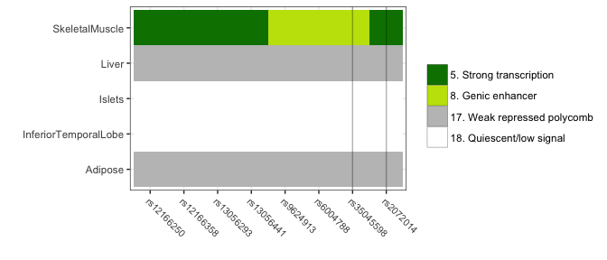

variantBedOverlap
================
Leland Taylor
2018-03-12

This document shows a demo of how to use variantBedOverlap. There is also a command line script.

``` bash
# get the lib dir for variantBedOverlap
install_dir=$(R --slave -e 'cat(find.package("variantBedOverlap"))')

# see help options of command line script
Rscript "$install_dir/exec/variant_bed_overlap.R" --help
```

(1) Get variants in LD
----------------------

Get proxies from the 1000 Genomes Project via [proxysnps](https://github.com/slowkow/proxysnps).

``` r
snps_q <- proxysnps::get_proxies(query = "rs2072014", pop = "FIN")
snps <- subset(snps_q, R.squared >= 0.8)
```

``` r
#knitr::kable( head(snps, 10) )
snps # enabled by setting --> df_print: paged
```

|     |  CHROM|       POS| ID         | REF | ALT |        MAF|  R.squared|  D.prime| CHOSEN |
|-----|------:|---------:|:-----------|:----|:----|----------:|----------:|--------:|:-------|
| 799 |     22|  26231688| rs2072014  | G   | A   |  0.3434343|   1.000000|        1| TRUE   |
| 760 |     22|  26228757| rs35045598 | TA  | T   |  0.3484848|   0.977926|       -1| FALSE  |
| 730 |     22|  26227039| rs13056293 | T   | C   |  0.3636364|   0.915385|       -1| FALSE  |
| 758 |     22|  26228540| rs6004788  | T   | C   |  0.3636364|   0.915385|       -1| FALSE  |
| 723 |     22|  26226815| rs12166250 | A   | G   |  0.3686869|   0.895680|       -1| FALSE  |
| 727 |     22|  26226935| rs12166358 | A   | G   |  0.3737374|   0.876507|       -1| FALSE  |
| 731 |     22|  26227108| rs13056441 | C   | T   |  0.3737374|   0.876507|       -1| FALSE  |
| 755 |     22|  26228281| rs9624913  | A   | G   |  0.3737374|   0.876507|       -1| FALSE  |

(2) Get BED overlaps
--------------------

Get the overlaps of each variant (row) and genomic regions from a list of BED files. Here we load example BED files included in this package taken from Varsheny et al. 2017 (<https://doi.org/10.1073/pnas.1621192114>).

``` r
# few pre-packaged bed files from 
# https://theparkerlab.med.umich.edu/data/papers/doi/10.1073/pnas.1621192114/
dir <- system.file("extdata", package = "variantBedOverlap", mustWork = TRUE)

# get overlaps with all bed files in directory
snps_overlap <- variantBedOverlap::get_bed_overlaps(
  df = snps,
  dir = dir,
  col_itemRgb = 5
)
```

processing file: Adipose processing file: InferiorTemporalLobe processing file: Islets processing file: Liver processing file: SkeletalMuscle

``` r
snps_overlap
```

| ID         |  CHROM|       POS| REF | ALT |        MAF|  R.squared|  D.prime| CHOSEN | bed.Adipose                                | bed.InferiorTemporalLobe               | bed.Islets                             | bed.Liver                                  | bed.SkeletalMuscle                |
|:-----------|------:|---------:|:----|:----|----------:|----------:|--------:|:-------|:-------------------------------------------|:---------------------------------------|:---------------------------------------|:-------------------------------------------|:----------------------------------|
| rs12166250 |     22|  26226815| A   | G   |  0.3686869|   0.895680|       -1| FALSE  | 17\_Weak\_repressed\_polycomb::192,192,192 | 18\_Quiescent/low\_signal::255,255,255 | 18\_Quiescent/low\_signal::255,255,255 | 17\_Weak\_repressed\_polycomb::192,192,192 | 5\_Strong\_transcription::0,128,0 |
| rs12166358 |     22|  26226935| A   | G   |  0.3737374|   0.876507|       -1| FALSE  | 17\_Weak\_repressed\_polycomb::192,192,192 | 18\_Quiescent/low\_signal::255,255,255 | 18\_Quiescent/low\_signal::255,255,255 | 17\_Weak\_repressed\_polycomb::192,192,192 | 5\_Strong\_transcription::0,128,0 |
| rs13056293 |     22|  26227039| T   | C   |  0.3636364|   0.915385|       -1| FALSE  | 17\_Weak\_repressed\_polycomb::192,192,192 | 18\_Quiescent/low\_signal::255,255,255 | 18\_Quiescent/low\_signal::255,255,255 | 17\_Weak\_repressed\_polycomb::192,192,192 | 5\_Strong\_transcription::0,128,0 |
| rs13056441 |     22|  26227108| C   | T   |  0.3737374|   0.876507|       -1| FALSE  | 17\_Weak\_repressed\_polycomb::192,192,192 | 18\_Quiescent/low\_signal::255,255,255 | 18\_Quiescent/low\_signal::255,255,255 | 17\_Weak\_repressed\_polycomb::192,192,192 | 5\_Strong\_transcription::0,128,0 |
| rs2072014  |     22|  26231688| G   | A   |  0.3434343|   1.000000|        1| TRUE   | 17\_Weak\_repressed\_polycomb::192,192,192 | 18\_Quiescent/low\_signal::255,255,255 | 18\_Quiescent/low\_signal::255,255,255 | 17\_Weak\_repressed\_polycomb::192,192,192 | 5\_Strong\_transcription::0,128,0 |
| rs35045598 |     22|  26228757| TA  | T   |  0.3484848|   0.977926|       -1| FALSE  | 17\_Weak\_repressed\_polycomb::192,192,192 | 18\_Quiescent/low\_signal::255,255,255 | 18\_Quiescent/low\_signal::255,255,255 | 17\_Weak\_repressed\_polycomb::192,192,192 | 8\_Genic\_enhancer::194,225,5     |
| rs6004788  |     22|  26228540| T   | C   |  0.3636364|   0.915385|       -1| FALSE  | 17\_Weak\_repressed\_polycomb::192,192,192 | 18\_Quiescent/low\_signal::255,255,255 | 18\_Quiescent/low\_signal::255,255,255 | 17\_Weak\_repressed\_polycomb::192,192,192 | 8\_Genic\_enhancer::194,225,5     |
| rs9624913  |     22|  26228281| A   | G   |  0.3737374|   0.876507|       -1| FALSE  | 17\_Weak\_repressed\_polycomb::192,192,192 | 18\_Quiescent/low\_signal::255,255,255 | 18\_Quiescent/low\_signal::255,255,255 | 17\_Weak\_repressed\_polycomb::192,192,192 | 8\_Genic\_enhancer::194,225,5     |

(3) Plot the data
-----------------

Plot the overlap data.

``` r
# xid_solid_line = list of x-axis IDs to add a line through
# varshney_chrhmm = flag to say assume BED file names are from Varshney et al
#                   2017. Given that assumption clean up the names to make them
#                   publication ready.
lst <- variantBedOverlap::plot_overlaps(
    df = snps_overlap,
    xid_solid_line = c("rs2072014", "rs35045598"),
    varshney_chrhmm = TRUE
)
print( lst$plt )
```



The output of plot\_overlaps also contains the data underlying the plot. Note that *ID* is a factor now, sorted by *POS*. If varshney\_chrhmm == TRUE, *bed\_feature* will also be a factor sorted by *chrhmm\_state*.

``` r
lst$df
```

| ID         |       POS| bed\_file            | bed\_feature                | color    |  chrhmm\_state|
|:-----------|---------:|:---------------------|:----------------------------|:---------|--------------:|
| rs12166250 |  26226815| Adipose              | 17. Weak repressed polycomb | \#C0C0C0 |             17|
| rs12166358 |  26226935| Adipose              | 17. Weak repressed polycomb | \#C0C0C0 |             17|
| rs13056293 |  26227039| Adipose              | 17. Weak repressed polycomb | \#C0C0C0 |             17|
| rs13056441 |  26227108| Adipose              | 17. Weak repressed polycomb | \#C0C0C0 |             17|
| rs2072014  |  26231688| Adipose              | 17. Weak repressed polycomb | \#C0C0C0 |             17|
| rs35045598 |  26228757| Adipose              | 17. Weak repressed polycomb | \#C0C0C0 |             17|
| rs6004788  |  26228540| Adipose              | 17. Weak repressed polycomb | \#C0C0C0 |             17|
| rs9624913  |  26228281| Adipose              | 17. Weak repressed polycomb | \#C0C0C0 |             17|
| rs12166250 |  26226815| InferiorTemporalLobe | 18. Quiescent/low signal    | \#FFFFFF |             18|
| rs12166358 |  26226935| InferiorTemporalLobe | 18. Quiescent/low signal    | \#FFFFFF |             18|
| rs13056293 |  26227039| InferiorTemporalLobe | 18. Quiescent/low signal    | \#FFFFFF |             18|
| rs13056441 |  26227108| InferiorTemporalLobe | 18. Quiescent/low signal    | \#FFFFFF |             18|
| rs2072014  |  26231688| InferiorTemporalLobe | 18. Quiescent/low signal    | \#FFFFFF |             18|
| rs35045598 |  26228757| InferiorTemporalLobe | 18. Quiescent/low signal    | \#FFFFFF |             18|
| rs6004788  |  26228540| InferiorTemporalLobe | 18. Quiescent/low signal    | \#FFFFFF |             18|
| rs9624913  |  26228281| InferiorTemporalLobe | 18. Quiescent/low signal    | \#FFFFFF |             18|
| rs12166250 |  26226815| Islets               | 18. Quiescent/low signal    | \#FFFFFF |             18|
| rs12166358 |  26226935| Islets               | 18. Quiescent/low signal    | \#FFFFFF |             18|
| rs13056293 |  26227039| Islets               | 18. Quiescent/low signal    | \#FFFFFF |             18|
| rs13056441 |  26227108| Islets               | 18. Quiescent/low signal    | \#FFFFFF |             18|
| rs2072014  |  26231688| Islets               | 18. Quiescent/low signal    | \#FFFFFF |             18|
| rs35045598 |  26228757| Islets               | 18. Quiescent/low signal    | \#FFFFFF |             18|
| rs6004788  |  26228540| Islets               | 18. Quiescent/low signal    | \#FFFFFF |             18|
| rs9624913  |  26228281| Islets               | 18. Quiescent/low signal    | \#FFFFFF |             18|
| rs12166250 |  26226815| Liver                | 17. Weak repressed polycomb | \#C0C0C0 |             17|
| rs12166358 |  26226935| Liver                | 17. Weak repressed polycomb | \#C0C0C0 |             17|
| rs13056293 |  26227039| Liver                | 17. Weak repressed polycomb | \#C0C0C0 |             17|
| rs13056441 |  26227108| Liver                | 17. Weak repressed polycomb | \#C0C0C0 |             17|
| rs2072014  |  26231688| Liver                | 17. Weak repressed polycomb | \#C0C0C0 |             17|
| rs35045598 |  26228757| Liver                | 17. Weak repressed polycomb | \#C0C0C0 |             17|
| rs6004788  |  26228540| Liver                | 17. Weak repressed polycomb | \#C0C0C0 |             17|
| rs9624913  |  26228281| Liver                | 17. Weak repressed polycomb | \#C0C0C0 |             17|
| rs12166250 |  26226815| SkeletalMuscle       | 5. Strong transcription     | \#008000 |              5|
| rs12166358 |  26226935| SkeletalMuscle       | 5. Strong transcription     | \#008000 |              5|
| rs13056293 |  26227039| SkeletalMuscle       | 5. Strong transcription     | \#008000 |              5|
| rs13056441 |  26227108| SkeletalMuscle       | 5. Strong transcription     | \#008000 |              5|
| rs2072014  |  26231688| SkeletalMuscle       | 5. Strong transcription     | \#008000 |              5|
| rs35045598 |  26228757| SkeletalMuscle       | 8. Genic enhancer           | \#C2E105 |              8|
| rs6004788  |  26228540| SkeletalMuscle       | 8. Genic enhancer           | \#C2E105 |              8|
| rs9624913  |  26228281| SkeletalMuscle       | 8. Genic enhancer           | \#C2E105 |              8|
